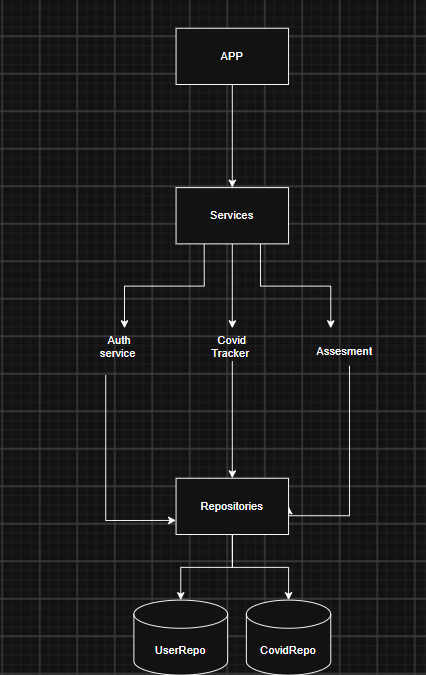

# Covid Tracker

## Problem Statement

Design an application called **Covid Tracker**.

Write code that tracks Covid records. The code should be demonstrable.

## Must-Have Cases

### Register and Login

Admin and regular users should be able to register and login.

### Covid Cases

Admin should be able to add, update, and delete regular users' Covid data.

### Self Assessment

Users should be able to assess themselves.

Assessment factors:

A. Not vaccinated  
B. Came in contact with a Covid patient  
C. Visited a Covid red zone  

- If A & B & C => 100% chance of being Covid Positive
- If A & B or A & C => 50%
- If B & C => 75%

### Covid Zones

Area pincode is used to decide the region.

- RED Zone: >= 75% cases
- ORANGE Zone: 25% <= cases <= 75%
- GREEN Zone: < 25%

## Bonus Cases

After completing the above cases, you can consider adding more features to the app, such as supporting more Covid factors, displaying Covid zones based on date ranges, etc.

Please note that bonus cases are good to have and are not mandatory.

## Some Tips

- Code should be modular.
- Code should be readable.
- It should be extensible. The panel mostly asks to add some extra features to the app, so we should be able to extend it easily.
- It should follow SOLID principles.
- Use Design Patterns wherever possible.
- Proper validations and exception handling wherever possible.
- Proper packaging structure.
- A terminal application is fine. You can simply consider the class with the `main` method as the driver class and provide inputs to the methods from there itself.
- You can also use a file to accept inputs (good to have).
- You can develop REST APIs if you can quickly write them. This is not recommended if the round is online, as it might unnecessarily introduce other issues. It is better to go with a driver class.

## Design



## Folder Design

```text
com.flipkart.covidtracker

|- model
|   |- User.java
|   |- CovidRecord.java
|   |- Role.java
|   |- Zone.java
|   |- Assessment.java
|
|- repository
|   |- UserRepository.java
|   |- CovidRepository.java
|   |- UserInMemoryRepository.java
|   |- CovidInMemoryRepository.java
|
|- services
|   |- AuthService.java
|   |- CovidService.java
|   |- AssessmentService.java
|   |- ZoneService.java
|
|- exception
|   |- UserNotFoundException.java
|   |- UserAlreadyExistsException.java
|   |- ValidationException.java
|
|- Main.java
